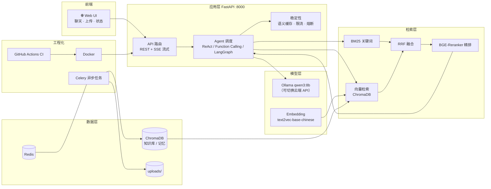

# 企业级 RAG 知识库问答系统

基于 **FastAPI + LangChain + Ollama** 从 0 到 1 构建的企业知识库智能问答系统。支持文档上传解析、混合检索 + Reranker 精排、Agent 工具调用、本地大模型部署与 LoRA 微调、RAGAS 自动化评测、Langfuse 可观测性、语义缓存/限流/熔断等稳定性治理，并通过 Docker + GitHub Actions 实现自动化交付。

> AI 应用开发实战项目：全链路（检索 → 生成 → Agent → 微调 → 评测 → 稳定性 → CI/CD）均含真实评测数据。

## ✨ 功能特性

- 📄 **文档上传与解析**：PDF（复杂表格→Markdown）/ DOCX / Excel / TXT；Celery + Redis 异步入库，上传秒回
- 🔍 **混合检索**：BM25 关键词 + 向量检索 + RRF 融合，BGE-Reranker 二次精排
- 🤖 **Agent 工具化**：ReAct + Function Calling，工具：知识检索 / 文档上传 / 时间 / 天气 / 长期记忆
- 🧠 **工作流**：LangGraph 条件分支 + 循环重试；多 Agent 协作（研究员 / 撰稿人）
- 🧬 **模型微调**：QLoRA 微调 3B 模型 + GGUF 量化，本地 8GB 显卡部署推理
- 📊 **自动化评测**：RAGAS（faithfulness / answer_correctness）
- 🔭 **可观测性**：Langfuse 全链路追踪（trace + llm_call）
- 🛡️ **稳定性**：语义缓存、用户级限流、熔断降级
- 🌐 **Web UI**：流式对话 + 文档上传 + 状态展示
- 🚀 **工程化**：Docker 容器化 + GitHub Actions CI 自动构建

## 🏗️ 系统架构



**数据流**：上传文档 → 解析分块 → Embedding → ChromaDB 入库 → 用户提问 → 混合检索（BM25 + 向量 + RRF）→ BGE-Reranker 精排 → Agent 组装上下文 → LLM 生成 → SSE 流式返回。

## 🧰 技术栈

| 分类 | 技术 |
| --- | --- |
| 后端 | Python 3.12 · FastAPI · Celery · Redis |
| AI 框架 | LangChain · LangGraph · Langfuse · RAGAS |
| 检索 | ChromaDB · BM25 · RRF · BGE-Reranker |
| 模型 | Ollama（qwen3:8b / qwen2.5）· QLoRA 微调 · GGUF 量化 · 阿里云百炼 API |
| 工程化 | Docker · GitHub Actions · Git |

## 📈 实测效果（本机 RTX 4060 8GB）

| 指标 | 说明 | 结果 |
| --- | --- | --- |
| RAGAS faithfulness | RAG 回答忠实度 | **0.81** |
| RAGAS answer_correctness | RAG 回答正确性 | **0.80** |
| 微调模型 answer_correctness | LoRA 微调 3B 直接回答 | **0.87** |
| LoRA 训练 | 146 条领域数据 / 3 epoch | loss 2.26 → 0.64 |
| 语义缓存 | 重复问答耗时 | 10s → **0.06s** |
| 用户限流 | 20 次/分钟 | 超限返回 429 |
| 熔断降级 | 连续失败 3 次 | 30s 快速拒绝 |
| 流式推理 | 本地 qwen3:8b | TTFT ≈ 2.7s · TPS ≈ 45 |

## 🚀 快速开始

```powershell
# 1. 安装依赖
pip install -r requirements.txt

# 2. 配置环境变量（密钥请填自己的）
Copy-Item .env.example .env

# 3. 启动 Redis（需自行安装）
redis-server

# 4. 启动 Celery worker
.\run.ps1 celery

# 5. 启动 API
.\run.ps1 dev
# 浏览器打开 http://localhost:8000 使用 Web UI
```

本地模型（可选，也可直接用云端 API）：

```powershell
ollama pull qwen3:8b
```

## 📁 目录结构

```
ai_learning/
├── src/ai_rag/
│   ├── main.py                # FastAPI 入口（挂载 Web UI）
│   ├── api/rag_router.py      # 上传 / 聊天 / 流式 / 工具 API
│   ├── agent/                 # Agent 调度与工具（检索/上传/时间/天气/记忆）
│   ├── core/                  # 配置、向量库、缓存、限流、熔断、可观测
│   ├── retrieval/             # BM25、混合检索、Reranker
│   ├── services/              # RAG 引擎、ETL 服务
│   ├── tasks/                 # Celery 异步任务
│   ├── parsers/               # PDF / DOCX / Excel / TXT 解析
│   └── web/index.html         # Web UI
├── scripts/                   # 微调 / 评测 / 验证脚本
├── docs/                      # 分周技术报告
├── Dockerfile
├── docker-compose.yml
└── .github/workflows/ci.yml   # GitHub Actions
```

## 🔒 安全说明

- `.env`（含密钥）已通过 `.gitignore` 排除，**不纳入版本控制**
- 环境变量示例见 `.env.example`，请替换为占位符后使用，切勿提交真实密钥

## 📄 License

MIT