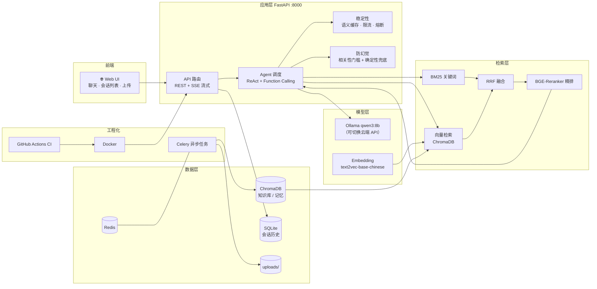

# 企业级 RAG 知识库问答系统

基于 **FastAPI + Ollama** 从 0 到 1 构建的企业知识库智能问答系统。支持文档上传解析、混合检索 + Reranker 精排、Agent 工具调用、多轮对话、长期记忆、RAGAS 自动化评测、Langfuse 可观测性，以及语义缓存 / 限流 / 熔断等稳定性治理，并通过 Docker + GitHub Actions 实现自动化交付。

> AI 应用开发实战项目：全链路（检索 → 生成 → Agent → 评测 → 稳定性 → 测试 → CI/CD）均含真实评测数据与自动化测试。

## ✨ 功能特性

- 📄 **文档上传与解析**：PDF / DOCX / Excel / TXT；Celery + Redis 异步入库，上传秒回
- 🔍 **混合检索**：BM25 关键词 + 向量检索 + RRF 融合，BGE-Reranker 二次精排
- 🤖 **Agent 工具化**：Ollama Function Calling + 自定义 ReAct 循环，工具：知识检索 / 当前时间 / 天气 / 长期记忆
- 💬 **多轮对话**：SQLite 会话与消息存储、Web 会话列表、滑动窗口 + Token 级上下文裁剪
- 🧠 **长期记忆**：跨会话保存用户身份/偏好，检索注入
- 🛡️ **防幻觉三层**：干净知识库（数据层）→ 重排分相关性门槛（检索层）→ 确定性兜底（生成层，流式/非流式双覆盖）
- ⚡ **语义缓存**：仅缓存带来源引用的答案（防缓存污染），文档入库自动失效
- 🧯 **稳定性**：用户级限流、熔断降级（Redis 分布式 + 内存兜底）
- 📊 **自动化评测**：50 条评估集（含 5 条陷阱题）+ RAGAS（faithfulness / answer_correctness）
- 🔭 **可观测性**：Langfuse 全链路追踪（trace + llm_call）
- 🌐 **Web UI**：流式对话 + 会话列表 + 文档上传 + 状态展示
- 🧪 **测试**：46 个 pytest 用例（单元 + 接口），CI 自动执行
- 🚀 **工程化**：Docker 容器化 + GitHub Actions CI 自动构建

## 🏗️ 系统架构



**数据流**：上传文档 → 解析分块 → Embedding → ChromaDB 入库 → 用户提问 → 混合检索（BM25 + 向量 + RRF）→ BGE-Reranker 精排 → 相关性门槛过滤 → Agent 组装上下文 → LLM 生成 → 幻觉兜底校验 → SSE 流式返回。

## 🧰 技术栈

| 分类 | 技术 |
| --- | --- |
| 后端 | Python 3.12 · FastAPI · Celery · Redis · SQLModel |
| AI 框架 | LangChain（工具）· Langfuse · RAGAS |
| 检索 | ChromaDB · BM25 · RRF · BGE-Reranker |
| 模型 | Ollama（qwen3:8b / qwen2.5）· QLoRA 微调脚本 · 阿里云百炼 API |
| 测试 | pytest · pytest-asyncio · httpx（TestClient） |
| 工程化 | Docker · GitHub Actions · Git |

## 📈 实测效果（本机 RTX 4060 8GB，评估集 50 题）

| 指标 | 说明 | 结果 |
| --- | --- | --- |
| RAGAS faithfulness | RAG 回答忠实度 | **0.88** |
| answer_correctness（自定义评判） | RAG 回答正确性 | **0.84** |
| 稳定性 | 50 题评估 | **50/50 零崩溃** |
| 陷阱题拒答 | 5 条知识库外问题 | **5/5 正确拒答** |
| 语义缓存 | 重复问答耗时 | 10s → **0.06s** |
| 用户限流 | 20 次/分钟 | 超限返回 429 |
| 熔断降级 | 连续失败 3 次 | 30s 快速拒绝 |
| 自动化测试 | pytest 单元 + 接口 | **46/46 通过** |

## 🚀 快速开始

```powershell
# 1. 安装依赖
pip install -r requirements.txt

# 2. 配置环境变量（密钥请填自己的）
Copy-Item .env.example .env

# 3. 启动 Redis（二选一：Docker 或本地安装）
docker run -d -p 6379:6379 redis:7-alpine
# 或本地: redis-server

# 4. 启动 Celery worker（异步入库）
.\run.ps1 celery

# 5. 启动 API
.\run.ps1 dev
# 浏览器打开 http://localhost:8000 使用 Web UI
```

> ⚠️ 注意：`.\run.ps1 dev`（宿主运行）与 Docker 里的 fastapi 容器会同时占用 8000 端口，**不要同时启动**。若用 Docker 全量部署，请先 `docker compose build` 再 `docker compose up -d`，且不要跑宿主 `.\run.ps1`。

本地模型（可选，也可直接用云端 API）：

```powershell
ollama pull qwen3:8b
```

## 📁 目录结构

```bash
ai_learning/
├── src/ai_rag/
│   ├── main.py                # FastAPI 入口（全局异常处理、挂载 Web UI）
│   ├── api/rag_router.py      # 上传 / 聊天 / 流式 / 检索诊断 / 工具 API
│   ├── api/conversation_router.py  # 会话 CRUD（含越权防护）
│   ├── agent/                 # Agent 调度与工具（检索/时间/天气/记忆）
│   ├── core/                  # 配置、向量库、缓存策略、幻觉兜底、限流、熔断、可观测
│   ├── retrieval/             # BM25、混合检索、Reranker
│   ├── services/              # RAG 检索服务、ETL 服务
│   ├── tasks/                 # Celery 异步任务
│   ├── parsers/               # PDF / DOCX / Excel / TXT 解析
│   └── web/index.html         # Web UI
├── tests/                     # 单元测试 + 接口测试（46 用例）
├── scripts/                   # 评估 / 建库 / 微调 / 验证脚本
├── docs/                      # 分周技术报告
├── Dockerfile
├── docker-compose.yml
└── .github/workflows/ci.yml   # CI：语法检查 + pytest + Docker 构建
```

## 🧪 测试与评估

### 自动化测试

- **单元测试**：语义缓存策略（仅缓存带来源引用的答案）、幻觉兜底判定（无依据 + 带数字 → 拒答）、上下文裁剪器（含工具调用字典兼容的崩溃回归）、Agent 工具调用解析等
- **接口测试**：会话 CRUD 与越权防护（B 用户读 / 删 / 改 A 会话均返回 404）
- 运行：`python -m pytest tests -v`
- CI：`.github/workflows/ci.yml` 每次 push 自动执行 `pytest`

### RAG 效果评估

- 评估集：`data/staff_qa_eval_50.json`（50 条带标准答案，覆盖 6 类文档 + 5 条知识库外陷阱题，由 `scripts/build_eval50.py` 生成）
- 指标：answer_correctness（LLM 评判）+ faithfulness（RAGAS）
- 运行：`python scripts/eval_ragas.py`（可设 `RAGAS_SKIP_FT=1` 跳过微调模型对比）
- 当前基线：correctness ≈ 0.84，faithfulness ≈ 0.88，50/50 零崩溃，5/5 陷阱题正确拒答

### 检索诊断

- 接口：`GET /api/rag/search?q=...&top_k=5`，返回混合检索原始命中（重排分 / 向量相似度 / 来源），用于调优排查
- 关键参数：`MIN_SIMILARITY=0.30`（向量相似度下限）、`RERANK_MIN_SCORE=0.20`（重排分相关性门槛）

## 🔒 安全说明

- `.env`（含密钥）已通过 `.gitignore` 排除，**不纳入版本控制**
- API 接口通过 `X-API-Key` 校验（未配置 `RAG_API_KEY` 时仅限内网使用）
- 会话接口强制校验归属，防止越权访问
- 环境变量示例见 `.env.example`，请替换为占位符后使用，切勿提交真实密钥

## 📄 License

MIT